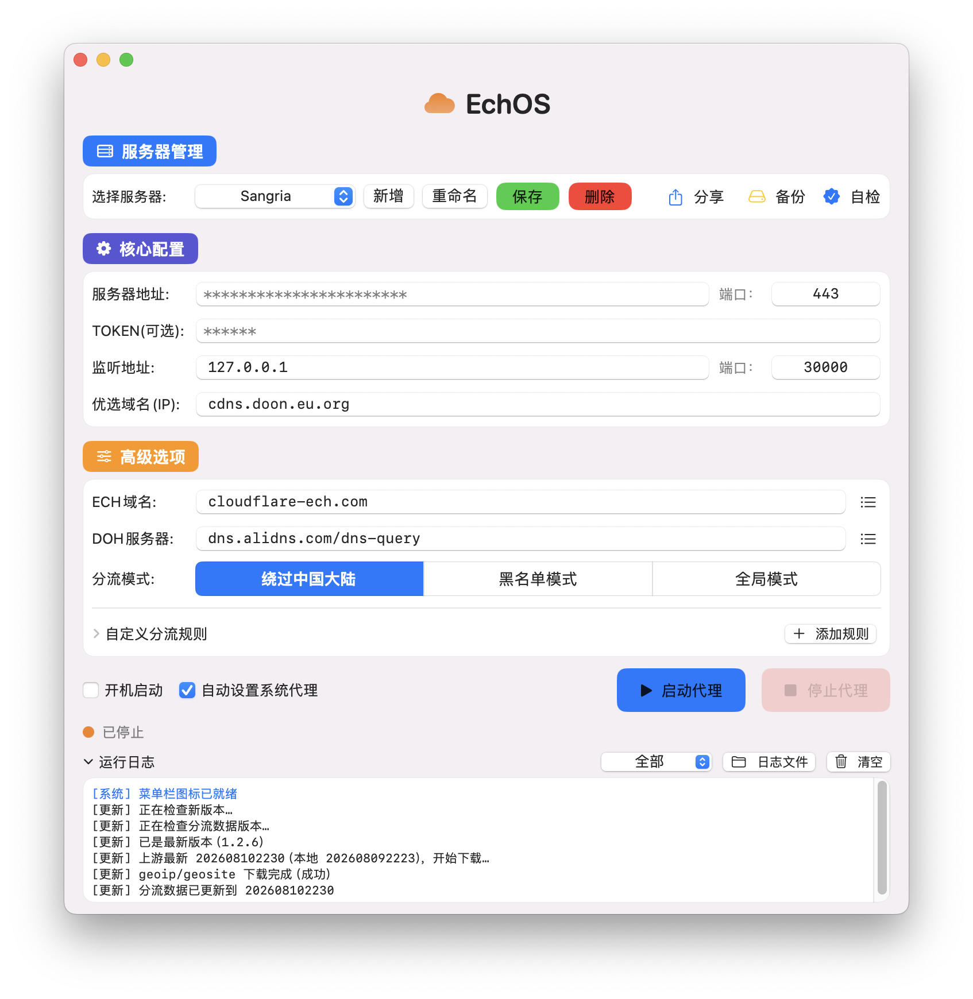
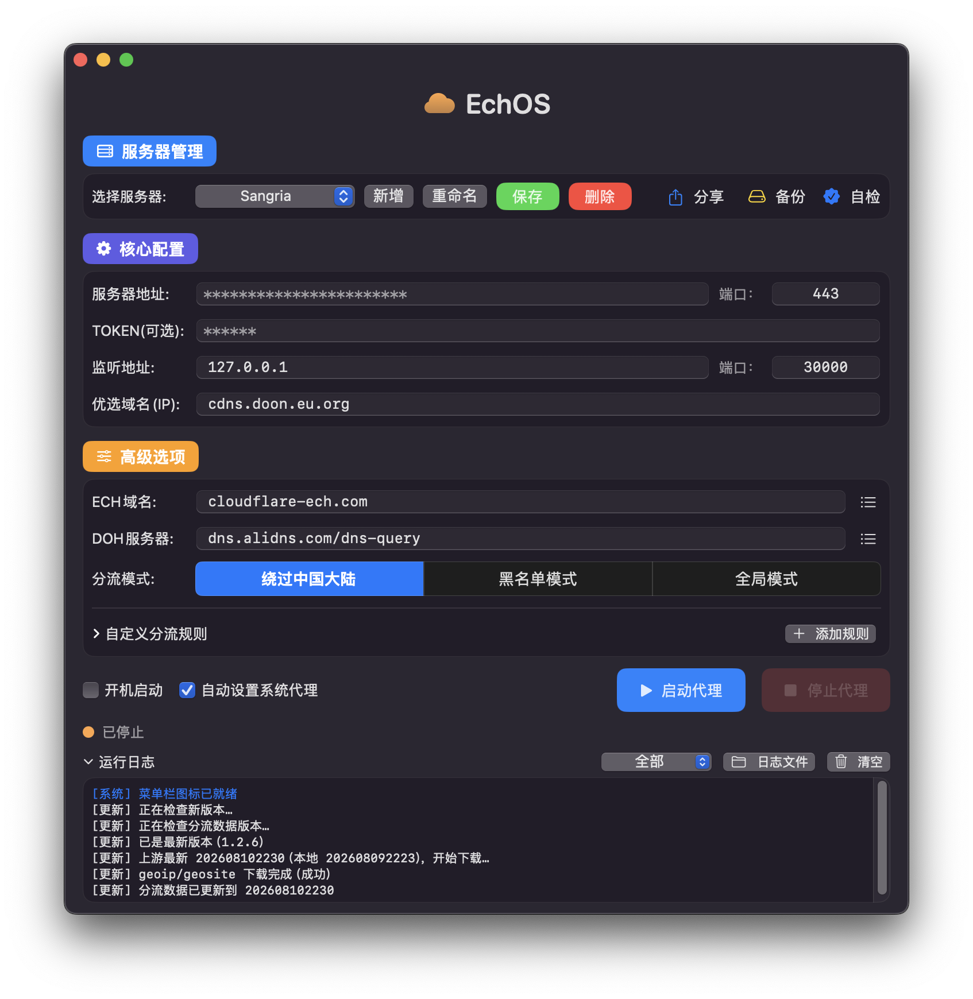

# EchOS

基于 **ECH（Encrypted Client Hello）** 的加密代理客户端，macOS 原生应用。

**Go 内核 + SwiftUI 界面**，一个 App 完成代理全部功能，不需要额外装 v2rayN / ClashX。
服务端跑在 Cloudflare Workers 上，免费额度足够个人日常使用。

---

## 界面预览

浅色 / 深色自动适配，跟随 macOS 系统外观自动切换，无需手动设置：

| 浅色 | 深色 |
|---|---|
|  |  |

> 多服务器管理、核心配置、分流规则、运行日志都在一个窗口里。

---

## 功能特性

- **ECH 加密隧道** — 基于 TLS ECH 的代理协议，抗 DPI 检测
- **SOCKS5 + HTTP 双协议本地代理** — 自动分配端口，HTTP 端口自动 +1
- **系统代理一键接管** — 启动即接管 Safari / Chrome 等全部系统代理流量，停止时自动还原。接管只作用于**当前默认路由所在的活动网络服务**（快且不碰无关网卡）；默认路由落在虚拟接口（有 VPN 在跑）时**自动跳过接管**，绝不和 VPN 抢流量。菜单栏图标在**接管成功后才变蓝**
- **三种分流模式（App 级）** — 绕过中国大陆 / 黑名单 / 全局；分流模式是全局参数，无论选中哪台服务器都遵从同一个，切换**立即生效并自动保存**（不要求点「保存」，重启不回退）。配合 v2rayN 使用时建议 v2rayN 负责分流、这里选「全局模式」当纯隧道出口
- **自定义分流规则** — 域名、IP 段、网站分类（geosite / geoip），支持搜索与展开查看
- **多服务器管理** — 新增即弹「新建服务器名称」；服务器名称唯一（重名拦截），最多 8 个汉字 / 16 个英文（输入时实时截断）；参数不完整时拒绝保存并说明；只有点过「保存」的服务器才会落盘，未保存的退出后自动丢弃。**运行中切换服务器**：状态栏菜单或主窗口下拉直接切换，自动重启代理换到新服务器生效
- **隧道兜底（防黑洞卡死）** — 客户端已向目标发过数据、服务端却长时间从未返回时（典型是 Worker 兼容日期不对导致出站数据不转发）自动断开并点名提示，连接不再永久挂起
- **自动检查更新** — 启动时后台静默检查 GitHub Releases；发现新版本用独立弹窗提示，确认后**自动下载 DMG 并替换 /Applications 里的旧版，完成后自动重启**（不需要手动拖拽；失败自动退回手动方式）；分流数据（geoip / geosite）也会随上游自动更新到本地数据目录。网络策略为**隧道优先、失败降级直连**（隧道出口共享 IP 被 GitHub API 限流 403 时自动改用家庭独立 IP 直连重试）。**更新源仓库不写死**：构建时自动取自 git remote（fork 后打包自动指向 fork 自己的仓库），也可环境变量覆盖
- **服务器分享** — 勾选已保存的服务器导出成文件（.json），或从分享文件一键导入；导入只接收参数完整的服务器，名称撞车时（服务地址+端口不同）自动改名「-01」防重复，无效/空壳/未保存的草稿自动过滤丢弃
- **整配置备份** — 本地文件 / WebDAV 两种备份方式；只备份已保存的服务器，WebDAV 密码存系统钥匙串；还原前逐台校验，参数不完整的自动跳过，不让坏数据污染配置
- **浅色/深色自动适配** — 跟随 macOS 系统外观自动切换
- **连通性自检** — 自检按钮任何状态都能点：未启动时预检**服务器地址（根路径须返回 `WebSocket Proxy Server`）+ Token 鉴权（真实 WebSocket 升级握手，与服务端不一致会直接报出）**，人工确认这套配置能用了再启动；启动时自动静默检测一次，运行中随时可手动复查完整连通性（本地端口、国内直连、隧道）。**自检通过后才接管系统代理**（菜单栏变蓝），隧道自检失败则彻底关闭代理，不留"假运行"状态。手动自检结果统一弹窗展示。国外站点为**多站点连通性探测**（gstatic / cloudflare 两个 `generate_204` 零字节端点，任一通过即隧道正常），避免出口被 Google 系屏蔽却被误杀
- **DoH 兼容** — 内核 DoH 查询支持 HTTP/2 与 HTTP/1.1（自定义 DialContext 下显式开启 HTTP/2），只支持 HTTP/2 的 DoH（如 `doh.onedns.net`）也能正常查询 ECH
- **菜单栏常驻 + 程序坞图标开关** — 适合挂后台
- **开机自启** — 登录 Mac 后自动启动。注册在系统「登录项 → 允许在后台运行」（这是 macOS 对无 Apple 开发者签名 App 提供的唯一途径，菜单栏常驻 App 的标准位置，`登录时打开` 需正式签名）；登录后静默常驻菜单栏，不弹主窗口。开关关闭时真正停止：卸载 launchd 任务 + 删除描述文件 + 翻转系统「已启用」记录，系统设置里的开关不会残留为开启
- **端口占用一键处理** — 启动时若监听端口被占用，弹窗标明占用进程（名称 + PID），可一键**强制结束占用进程并自动重启**，或取消保持停止
- **启动失败智能提示** — 启动失败弹窗按 2+1 分类直接说清原因：TOKEN 与服务器端不一致 / 服务器连接失败（解析失败、拒绝、超时、握手失败）/ 识别不出再看日志；域名解析失败还能指出是「服务地址」还是「优选IP/域名」填错
- **未保存改动保护** — 只有点过「保存」的服务器才会落盘；有未保存改动时「保存」按钮橙色高亮，启动前会拦截提示先保存，不会带着改了一半的参数跑起来
- **运行日志** — 界面日志 + 落盘文件（`logs/`，可回溯上次崩溃）。日志区展开时恰好显示完整 4 行（滚动到底无残影），底部内边距完整不截断；窗口高度随内容自动贴合

---

## 系统要求

- macOS 13.0+
- Intel 或 Apple Silicon（通用二进制）

---

## 快速开始

### 使用预打包 DMG

1. 打开 `EchOS-mac-<版本>-universal-x64.dmg`
2. 将 `EchOS.app` 拖入 `Applications`
3. 首次运行时**右键 → 打开**（无 Apple 开发者签名，Gatekeeper 会拦截）
4. 首次启动弹出「新建服务器名称」，起名后填好服务器配置 → 点「保存」→ 点「启动代理」

### 配置项

| 字段 | 说明 | 示例 |
|---|---|---|
| 服务地址 | Workers 域名（不含协议头） | `xxx.workers.dev` |
| 服务端口 | 连接端口 | `443` |
| 监听地址 | 本地代理地址 | `127.0.0.1` |
| 监听端口 | SOCKS5 端口，HTTP 自动 +1 | `30000` |
| 优选IP(域名) | Cloudflare 优选 IP，逗号分隔 | `104.16.158.132` |
| ECH域名 | ECH 公钥查询域名 | `cloudflare-ech.com` |
| DOH服务器 | ECH 公钥查询 DNS | `dns.alidns.com/dns-query` |
| TOKEN | 可选，与服务端 Workers 的 `TOKEN` 环境变量一致 | |

> **ECH域名 / DOH服务器 已内置常用选项**：ECH 域名下拉含 `cloudflare-ech.com`、`crypto.cloudflare.com` 等；
> DOH 含阿里 DoH、腾讯国密 DoH、360 DoH、OpenDNS、Quad9 等国内外共 10 个，直接选即可，无需手动去查。
> 感谢 [@CM 大佬](https://t.me/CMLiussss)（优选 IP 方案与其维护的 ProxyIP 同源）整理。

---

## Cloudflare 部署（服务端）

服务端是一个 Cloudflare Worker，仓库根目录的 `Worker-ECH.js` 就是完整代码。仓库已带 `wrangler.toml` 和 `deploy-worker.sh`，两种方式任选：

> <span style="color:red">**⚠️ 必读：Worker「兼容日期」必须设为 26 年之前的任意日期**（26 年 4 月群友反馈：用 26 年内的日期部署后隧道无法使用）。</span>
>
> 设置位置：Worker 项目 → **Settings（设置）→ Running（运行时）→ Compatibility Date（兼容日期）** 改成 `Sep 15, 2025`。
>
> 命令行部署（方式一）已由 `wrangler.toml` 的 `compatibility_date = "2025-09-15"` 自动带上；网页部署（方式二）需手动设置。

### 方式一：命令行一键部署（推荐）

```bash
# 安装 wrangler（需要 Node.js 环境）
npm install -g wrangler

# 首次需要登录 Cloudflare 账号（会打开浏览器）
wrangler login

# 部署；需要鉴权时带上 TOKEN（值自定义，一长串随机字符）
TOKEN=你的密钥 ./deploy-worker.sh
```

`wrangler.toml` 里的 `name` 就是 Worker 名称，部署前可自行修改。

### 方式二：网页 Dashboard 手动部署

1. 打开 [Cloudflare Dashboard](https://dash.cloudflare.com) → **Workers & Pages** → **Create** → 选 **Workers**
2. 名称随意，创建后点 **Edit code**，用 `Worker-ECH.js` 的内容覆盖默认代码，保存
3. <span style="color:red">**设置兼容日期**：**Settings（设置）→ Running（运行时）→ Compatibility Date（兼容日期）** 改成 `Sep 15, 2025`（⚠️ 不设则隧道数据不通，现象是「能连上但打不开网站」）</span>
4. 可选：**Settings → Variables and Secrets → Add**，加一个环境变量 `TOKEN`
   - 设了 TOKEN 后，客户端必须填相同的 TOKEN 才能连上
   - 不设 TOKEN 就是全公开，任何人都能拿你的 Worker 当代理，**强烈建议设置**
5. 部署后得到一个 `https://<你的名称>.workers.dev` 地址，填进客户端的「服务地址」

> 无需绑定域名、无需支付。Worker 免费计划每天 10 万请求，个人使用绰绰有余。

---

## 从源码构建

需要 Xcode 命令行工具（`swiftc`）和 Go 1.22+。

```bash
# 1) 下载分流规则数据（geoip.dat / geosite.dat，24MB 二进制，不进仓库）
./fetch-geodata.sh

# 2) 编译 App（通用二进制，Intel + Apple Silicon）
./build.sh

# 仅编译当前架构（更快）
UNIVERSAL=0 ./build.sh

# 3) 打包 DMG（成品输出到项目根目录 `EchOS-mac-<版本>-universal-x64.dmg`）
./make-dmg.sh
```

产物：`build/EchOS.app`（DMG 由 `make-dmg.sh` 输出到项目根目录，见下）

> `fetch-geodata.sh` 下载过之后会跳过；想强制更新最新数据，删掉 `assets/geoip.dat`
> 和 `assets/geosite.dat` 再跑一次即可。

---

## 项目结构

```
EchOS/
├── Worker-ECH.js          # Cloudflare Worker 服务端（完整代码）
├── wrangler.toml          # Worker 配置（名称、入口）
├── deploy-worker.sh       # 一键部署脚本（wrangler CLI）
├── CHANGELOG.md           # 更新日志（发版时自动作为 Release 正文）
├── fetch-geodata.sh       # 下载分流数据 geoip.dat / geosite.dat
├── build.sh               # 编译脚本（通用二进制 / 单一架构）
├── make-dmg.sh            # DMG 打包脚本（成品输出到项目根目录）
├── core/                  # Go 内核 (x-tunnel)
│   ├── x-tunnel.go        # 入口：参数解析、端口监听、隧道调度
│   ├── simple_ws.go       # WebSocket 隧道
│   ├── route_*.go         # 分流规则（geosite / geoip）
│   └── tun_*.go           # TUN 相关（macOS 未启用）
├── gui/                   # SwiftUI 界面
│   ├── Info.plist
│   ├── AppIcon.icns
│   └── Sources/
│       ├── App.swift           # 入口 + AppDelegate
│       ├── AppState.swift      # 状态管理、内核生命周期、系统代理接管/还原
│       ├── Config.swift        # 配置模型、命令行参数
│       ├── ContentView.swift   # 主界面
│       ├── SelfCheck.swift     # 连通性自检（预检 / 完整检测）
│       ├── SystemProxy.swift   # 系统代理后台接管（SystemProxyWorker actor）
│       ├── StatusBar.swift     # 菜单栏控制器
│       ├── LoginItem.swift     # 开机自启
│       ├── LogFile.swift       # 日志落盘
│       ├── KernelPID.swift     # 内核进程管理与崩溃恢复
│       ├── Updater.swift       # 自动更新（检查 / 下载 / 替换 / 重启）
│       ├── ServerShare.swift   # 服务器分享导出/导入
│       ├── WebDAVClient.swift  # WebDAV 备份客户端
│       ├── WebDAVSettingsView.swift # WebDAV 备份设置界面
│       ├── KeychainStore.swift # 系统钥匙串（WebDAV 密码）
│       ├── ModeSegment.swift   # 分流模式选择器
│       ├── PortPicker.swift    # 端口选择
│       ├── CloudIcon.swift     # 菜单栏云朵图标（代码绘制）
│       ├── Frosted.swift       # 毛玻璃背景组件
│       └── ShareSheet.swift    # 分享面板
├── assets/                # 分流数据（构建前下载）、DMG 卷图标源文件
├── screenshot/            # 界面截图（浅色 / 深色）
└── .github/workflows/
    └── release.yml        # 打标签自动构建 DMG 并发 GitHub Release
```

---

## 分发说明

- DMG 不含任何用户配置（配置文件在 `~/Library/Application Support/EchOS/config.json`，密码在系统钥匙串）
- 首次启动自动创建一台服务器并弹出「新建服务器名称」命名框；只有点过「保存」的服务器才会写入配置，未保存的服务器退出后自动丢弃
- 没有 Apple Developer ID 签名，对方首次需要**右键 → 打开**绕过 Gatekeeper
- 如要彻底消除 Gatekeeper 弹窗，需购买 Apple Developer Program 并签名
- 发版：推 `v*` 标签自动触发 `.github/workflows/release.yml`，CI 里构建通用二进制、打 DMG 并发布 GitHub Release（正文取 `CHANGELOG.md` 对应版本段落）；不想重复打包时只推目标版本标签即可，中间版本标签保留本地

## 不传 GitHub 的文件

以下内容**不会**出现在 GitHub 仓库里（`.gitignore` 兜底）：

| 内容 | 原因 |
|---|---|
| `build/`（app、DMG 中间产物） | 编译产物，由 Actions 发版时自动生成 |
| 根目录 `EchOS-mac-*.dmg` | 本地 `make-dmg.sh` 打出的成品包，不入库 |
| `assets/geoip.dat`、`assets/geosite.dat` | 24MB 二进制，上游开源数据，构建前用 `fetch-geodata.sh` 下载 |
| `.DS_Store` | macOS 系统文件 |
| `config.json`、`logs/` | 用户配置与日志（在用户目录，运行时生成） |

---

## 开源说明

- 本项目基于 MIT 协议开源，详见 [LICENSE](LICENSE)
- **仅供学习交流使用，请勿用于商业用途；请在下载后 24 小时内删除。**
- 请遵守所在地区的法律法规；ECH 是加密传输技术，本身无好坏之分，请勿用于任何非法用途
- `assets/geoip.dat`、`assets/geosite.dat` 为分流规则数据，遵循各自上游开源协议
- 本项目不提供任何可用的公共代理服务器，服务端需自行部署（见上文 Cloudflare 部署）

---

## 致谢与来源说明

本项目是面向 macOS 的 ECH 加密代理客户端，在多位开源作者的工作基础上适配而来。特别感谢：

- **CCF 大佬**（[@CCF](https://t.me/JPCCF)）—— 客户端开发与整体方案设计，核心能力基于其开源项目 [CF_NAT](https://t.me/CF_NAT) 构建
- **byJoey 大佬** —— 部分实现参考其开源项目 [ech-wk](https://github.com/byJoey/ech-wk)
- **CM 大佬**（[CMLiussss](https://t.me/CMLiussss)）—— 优选 IP 方案参考其维护的 ProxyIP 定制优化

在此基础上定制修改出的 Mac 端专用客户端，让部署到 Cloudflare Workers 后的连接、分流与使用体验更加便捷。

本文涉及的工具与技术方案均来源于：

| 内容 | 来源 |
|---|---|
| 客户端开发 | [CCF](https://t.me/JPCCF) |
| 核心开源项目 | [CF_NAT](https://t.me/CF_NAT) |
| 优选 IP（ProxyIP） | [CMLiussss](https://t.me/CMLiussss) |
| ECH 协议技术 | [Cloudflare 官方文档](https://developers.cloudflare.com/ssl/edge-certificates/ech/) |
| 文档支持 | [Cloudflare-ECH-Workers](https://blog.zrf.me/p/Cloudflare-ECH-Workers) |
